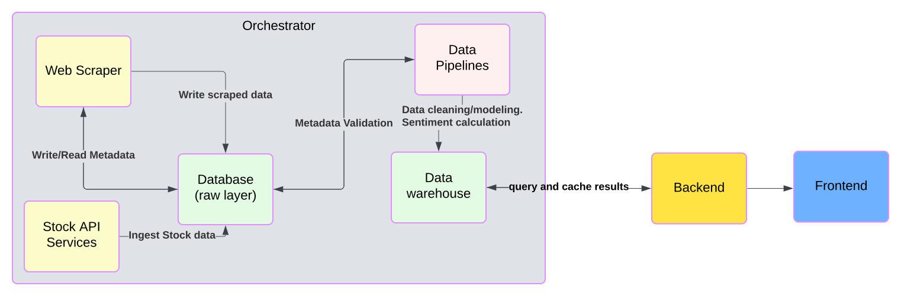
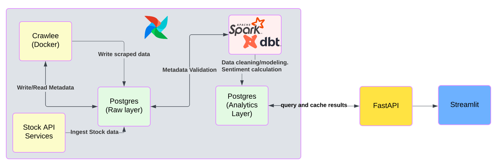

# Project Overview

**Goal**

- Develop a platform, to show reliable sources for stock news

**Primary Objectives**

1. Provide insights into stock trends based on articles' sentiment.
2. Demonstrate relationships between stock performance and journalists/publishers/industries trends.
3. Showcase daily updates and predictions (updates each night, maybe?).
4. Highlight engineering skills in data architecture, web scraping, pipelines orchestration, and advanced analytics.

---

## **Requirements**

### 1. **Functional Requirements**

#### Core Features:

1. **Stock Sentiment Analysis**:
   - Compute and display average news sentiment (positive, neutral, negative) per company.
   - Provide detailed sentiment insights per journalist/publisher.
   - Highlight industry-level sentiment trends.
2. **Stock-Dependency Analysis (How FOMO they are):**
   - Visualize the dependence of stock performance on:
   - News polarity trends.
   - Specific journalists' opinions.
   - Track relationships between industry sectors and aggregated sentiment.
3. **Data Timeliness**:
   - Daily data updates and sentiment analysis pipelines.
4. **Dashboard Filtering**:
   - Filter by stock ticker, news source, polarity, journalist, industry, and date range.

---

### 2. **Technical Requirements**

#### Data Management:

1. Crawl news articles from multiple sources:
   - News sources: **CNBC**, **Reuters**, and **Fox News**.
   - Social media: **X**, **Reddit**, and **Facebook**.
2. Maintain a PostgreSQL database for:
   - Scraped raw data.
   - Checkpoints (last scraped timestamps for each source).
   - Derived sentiment weights and insights.

#### Data Engineering Pipelines:

1. **Web Scraping**:
   - Use **Crawlee (TypeScript)** for parallel and efficient scraping.
   - Extract sentiment indicators and metadata.
2. **Data Orchestration**:
   - Use **Apache Airflow** for workflow automation and retry mechanisms.
3. **Batch Processing and Analytics**:
   - Leverage **PySpark** and **dbt** for cleaning, transformation, and deriving sentiment weights.

#### Sentiment Analysis:

- Hybrid NLP pipeline using SparkNLP for entity recognition and Weaviate for vector similarity
- Custom sentiment scoring algorithm combining:
  - Word polarity weights from batch processing
  - Contextual tone analysis using transformer models
  - Industry-specific sentiment adjustments
- Real-time inference using PySpark Structured Streaming

#### Backend Services:

- Expose RESTful APIs via **FastAPI**, enabling filtered queries for the dashboard.

#### Frontend Dashboard:

- Build an interactive web interface using **Streamlit** with comprehensive filtering options.

#### Integration:

- Use **Polygon.io** for stock data ingestion:
  - Sync historical stock data, and update stockprice once each day to the PostgreSQL warehouse.
  - Right now, it WILL NOT Stream new stock price updates in real-time.
  - Only through PostgreSQL

---

## **Architecture Design Assumptions**

1. **Scalability Assumption**:
   - The system will support at least 1,000 stocks and daily scraping of as much articles as `robots.txt` allowed (100k max).
   - Scaling is based on:
     - How much the file `robots.txt` allow
     - How much the proxies services allow.
2. **Availability Assumption**:
   - The App currently serve local usage.
3. **Polygon.io API**:
   - Assumed to provide reliable filtered batch data upon requests.

---

## **Constraints**

1. **Budget Constraint**:
   - Use all open-source tools (e.g., Airflow, Spark), for local deployment.
2. **Latency Constraint**:
   - Ensure daily updates complete within 3 hours of article availability.
3. **External Dependencies**:
   - Dependence on third-party APIs like **Polygon.io** for stock data and journalist databases for credibility scores.

---

## The Architecture - Layered

### Logical Architecture Components

- The Web Scraping service:
  - Scraping, Validating news sources
  - Saving scraping process, as metadata in database.
- The Database, for storing:
  - Scraped raw data
  - Metadata for scraping process.
  - Stock data from API services
- The Data pipelines, for:
  - Validation, then update the scraping metadata (articles needed to be re-scraped ?)
  - Cleaning Raw scraped data, to output:
    - Data models (Authors, articles, industries, news sources, stock (company))
    - Sentiment weights (of words, and article-stock relationships)
    - Anlytics (pre-compute)
  - Ingest Stock data from API services
- The Data warehouse, for:
  - Sentiment weights of words
  - Sentiment weithts of article-stock relationships
    - each row is one article ID, one stock ID
  - Data Modeling and cleaning for real entities
    - Authors, articles, industries, news sources, stock (company)
  - Analytics:
    - Real time sentiment analytics querying
    - Cached analytics: query results and pre-compute.
- The Frontend: Serving the dashboard
- The Backend:
  - Serving the queries results to frontend
  - On request, decide if the results should be from cache
    - or perform queries
- The Orchestrator:

  - Schedule and retry scraping pipelines
  - Send Alerts to Email

- For NLP Processing:
  - Spark NLP for entity recognition and text processing
  - Weaviate vector database for GICS code and company embeddings
  - Hybrid approach combining:
    - Cached entity embeddings (companies/industries)
    - On-the-fly article vectorization

### Physical Architecture Components:

- For the small scale of project and resources from one man.
  - All the tools need to be popular with great community support
  - They need to also be easy to use.
- The Orchestrator: Airflow
- Frontend: Streamlit
- Backend: FastAPI
- For Web scraper, it needs to:
  - Handle both dynamic and static pages
  - Have features that respect `robots.txt` file
  - Concurrently scrape the news source
  - Fake human interactions  
    => [crawlee (NodeJS)](https://crawlee.dev/#) (the python version has fewer support, not having features for `robots.txt`)
- For Data pipelines, it needs to:
  - Easily do data modeling
  - Have capability for sentiment analysis
  - Popular API
  - Nice integration with Airflow and database, datawarehouse  
    => **PySpark and dbt**
- For the simplicity of the project:

  - Both the data warehouse and database will be the same tool
  - The database tool needs to be integrate well with Crawlee, PySpark, dbt, Airflow, FastAPI, Streamlit  
    => Postgres

- The NLP Processing Layer:
  - Document vectorization using hybrid approach (entity-aware embeddings)
  - GICS code relevance matching using vector similarity
  - Article-stock relevance scoring through:
    1. Industry-sector vector matching
    2. Company-specific entity recognition
    3. Contextual sentiment analysis
  - Relationship analysis between article tone and historical stock performance

## Cloud Deployment

### AWS Service Equivalents

| Project Component | AWS Equivalent            | Deployment Method        |
| ----------------- | ------------------------- | ------------------------ |
| Apache Airflow    | Astronomer                | IaaS                     |
| PostgreSQL        | RDS PostgreSQL            | AWS Managed Service      |
| Crawlee Scrapers  | Apify Platform            | External Service         |
| PySpark           | AWS Glue (Serverless ETL) | Managed Spark Jobs       |
| FastAPI           | App Runner/Fargate        | Containerized (Fargate)  |
| Streamlit         | Amplify Hosting           | Static Site + Fargate BE |
| dbt               | Fargate Task              | Containerized            |
| Weaviate          | Fargate + EC2             | Containerized            |
| Spark NLP         | AWS Glue                  | AWS Managed Service      |

Key Features:

- **AWS Glue** replaces EMR for serverless Spark execution
- Maintains open-source compatibility through managed services
- Astronomer for the ability to scale to zero
- Fargate containers for custom components
- Apify integration for managed scraping
